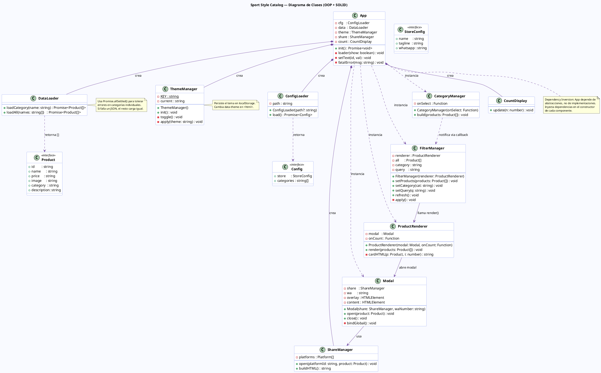

# Diagrama UML — Sport Style Catalog

## Diagrama de Clases (PlantUML)

Copia el bloque siguiente en https://www.plantuml.com/plantuml/uml/ para ver el diagrama renderizado.



---

## Diagrama de Flujo — Carga Inicial

```
Navegador abre index.html
        │
        ▼
  DOMContentLoaded → new App().init()
        │
        ├─► ThemeManager.init()       ← aplica tema guardado
        │
        ├─► loader(true)              ← muestra spinner
        │
        ├─► ConfigLoader.load()
        │     └─ fetch data/config.json
        │           ├─ store.name, tagline, whatsapp
        │           └─ categories: ["zapatillas","camisetas","accesorios"]
        │
        ├─► DataLoader.loadAll(categories)
        │     ├─ fetch data/zapatillas.json  ─┐
        │     ├─ fetch data/camisetas.json    ├─ Promise.allSettled
        │     └─ fetch data/accesorios.json  ─┘
        │           └─ retorna Product[] (todos juntos)
        │
        ├─► new Modal(shareManager, whatsapp)
        ├─► new ProductRenderer(modal, count => CountDisplay.update(count))
        ├─► new FilterManager(renderer)
        │
        ├─► CategoryManager.build(products)
        │     └─ genera botones: [Todos | Zapatillas | Camisetas | Accesorios]
        │
        ├─► search-input.addEventListener('input', filter.setQuery)
        │
        ├─► filter.refresh()          ← render inicial completo
        │
        └─► loader(false)             ← oculta spinner
```

---

## Diagrama de Secuencia — Click en Producto

```
Usuario                 ProductCard     Modal           ShareManager
  │                         │             │                  │
  │── click ──────────────► │             │                  │
  │                         │             │                  │
  │                   JS captura evento   │                  │
  │                         │── open(p) ─►│                  │
  │                         │             │── buildHTML() ──►│
  │                         │             │◄── HTML ─────────│
  │                         │             │                  │
  │                         │             │ popula DOM       │
  │                         │             │ modal.classList.add('active')
  │                         │             │                  │
  │◄── modal visible ───────────────────── │                  │
  │                         │             │                  │
  │── click "Pedir" ────────────────────►  │                  │
  │                         │             │ abre wa.me/...   │
  │── click "Compartir" ────────────────►  │                  │
  │                         │             │── open(platform,p)─►│
  │                         │             │                  │ abre red social
```

---

## Estructura de Carpetas

```
galeryProject/
├── index.html                    ← HTML puro, sin lógica
├── css/
│   └── style.css                 ← Estilos + variables CSS (dark/light)
├── js/
│   └── script.js                 ← 10 clases OOP, ~320 líneas
├── data/
│   ├── config.json               ← ⚙️  WhatsApp, nombre, categorías
│   ├── zapatillas.json           ← Productos de zapatillas
│   ├── camisetas.json            ← Productos de camisetas
│   └── accesorios.json           ← Productos de accesorios
└── assets/
    ├── placeholder.svg           ← Imagen de respaldo si falla img
    ├── zapatillas/
    │   ├── jordan_air_force.svg
    │   ├── jordan_1_retro.svg
    │   └── nike_air_max.svg
    ├── camisetas/
    │   ├── nike_dryfit.svg
    │   ├── adidas_basic.svg
    │   └── under_armour.svg
    └── accesorios/
        ├── gorra_nike.svg
        └── mochila_adidas.svg
```
